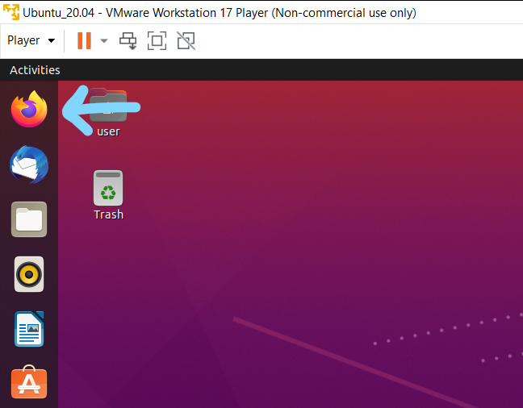
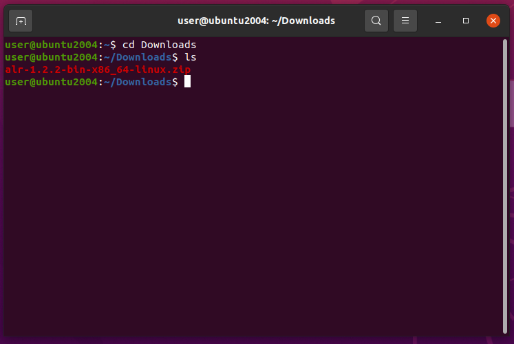
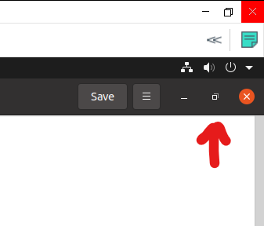
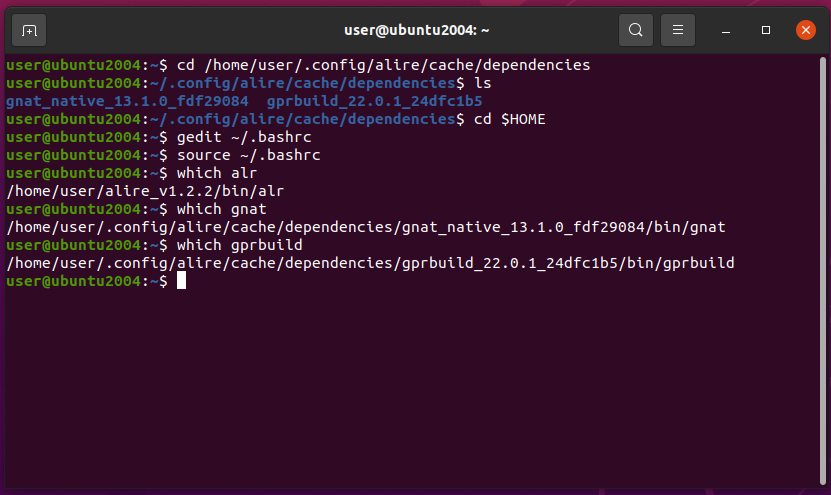
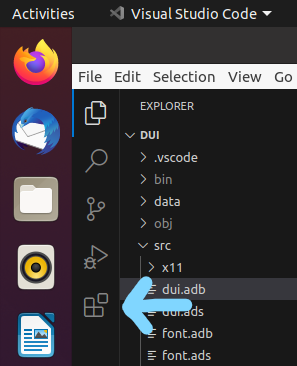
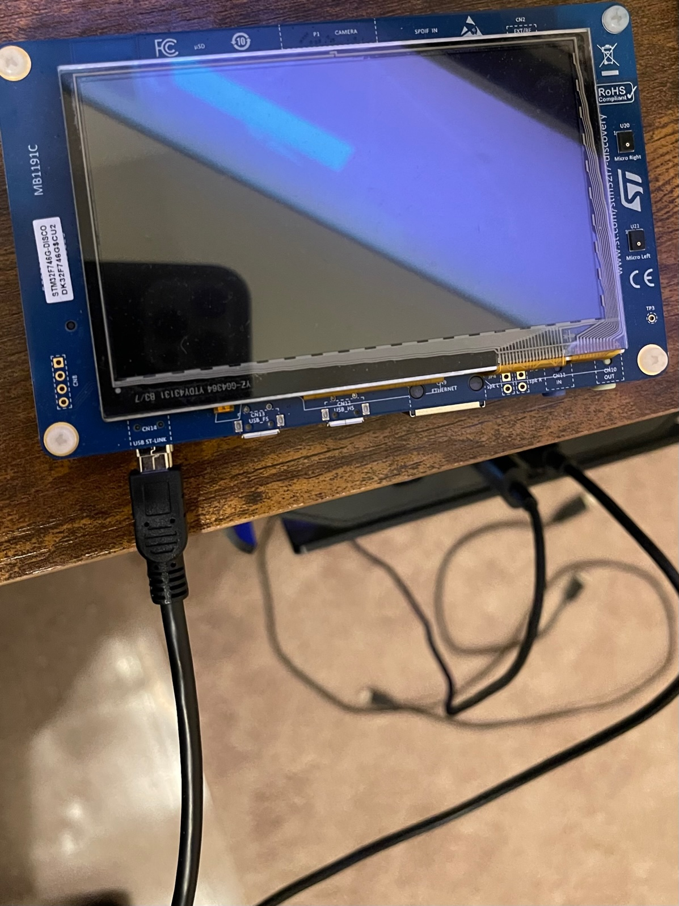
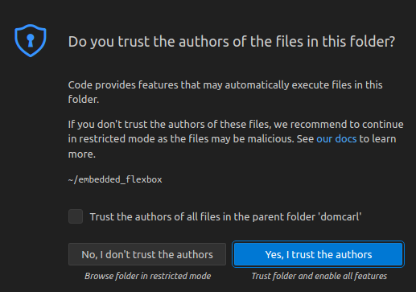

# Embedded, Baremetal, CSS Flexbox (in Ada)

AdaCore wants to demonstrate that their toolset and technologies can be used to implement complex software systems (like Flexbox) in resource-constrained environments (like a bare metal microcontroller). By demonstrating this, AdaCore can showcase Ada’s versatility to AdaCore and the wider Ada programming community, which will give AdaCore more deliverables for their current customer base and expand AdaCore’s existing clientele.

AdaCore additionally wants to advertise the Ada programming language to a wider audience. The industry perception is generally negative with regards to Ada. Many companies relegate Ada to the dustbin of history, with only legacy code and defense contractors running the language. By showcasing the abilities of Ada through a popular delivery means, AdaCore can reach more customers with their products.


## Authors

- [Stuart Walters](https://github.com/sewalters)
- [Kien Nguyen](https://github.com/KNguyen5256)
- [John Shimer](https://github.com/Utavon)
- [Dominick Carlucci](https://github.com/DomCarl)

## Acknowledgements

 - Dr. Naseem Ibrahim
 - Olivier Henley
 - [AdaCore](https://www.adacore.com)
 - [Penn State College of Engineering](https://www.psu.edu)

## How to Setup Environment
### The set-up instructions make the following assumptions: 
    Users are working in a Windows environment
    Users know and have already set up a new 64-but Ubuntu v20.04 virtual machine (VM)
    Users are familiar with terminal commands
    Users know how to use Git
### To begin setting the development environment for DUI:
1. In Figure 39, on the left-hand side of the Ubuntu VM screen, click and open the Firefox browser.

2. As shown in Figure 40 go to https://alire.ada.dev/ and click "Download Alire for Linux" for a .zip

3. Minimize Firefox and click on the grid of nine squares in the bottom left corner of the screen as shown in Figure 41.  

4. Find and open the Terminal application which is circled in Figure 42.

5. Inside the terminal, run ```sudo apt install build-essential```           
6. Run ```mkdir alire_v1.2.2``` to create a directory; you can name the directory whatever you want.  
7. Do ```cd Downloads``` and you should be in the same directory as the downloaded .zip; see Figure 43 for an example.

8. Run ```unzip [zip_folder] -d [alire_directory]```, replacing [zip_folder] and [alire_directory] appropriately; make sure to use the absolute path form of the directory (e.g., “/home/user/alire_v1.2.2”).  
9. Do ```cd ..``` and then run ```gedit ~/.bashrc``` to open a text editor.  
10. Scroll to the bottom of the file and type on a new line at the end of file ```export PATH="/home/[username]/[alire_directory]/bin:$PATH"```, replacing the bracketed words appropriately; refer to Figure 44 for an example.  
    1. You may need to resize the text editor with the Restore/Maximize button (which is next to the red X button in the top right as depicted in Figure 44a) to fully scroll to the bottom.


11. Click the “Save” button on the top right as shown in Figure 45 and then close the text editor.

12. Back in the terminal, do ```source ~/.bashrc``` and then do ```which alr``` which should return the directory you entered into .bashrc plus “/alr” as displayed similarly in Figure 46.

13. Run ```alr toolchain --select```.  
14. Follow the instructions that appear in the terminal to install “gnat_native” version 13.1.0 and “gprbuild” version 22.0.1; you should have something similar to Figure 47.

15. Once those installations are finished, do ```cd /home/[username]/.config/alire/cache/dependencies```.  
16. Run ```ls``` and you should see two directories that contain the “gnat_native” and “gprbuild” versions you installed; the results of this step and the previous step are shown in Figure 48.

17. Do ```cd $HOME``` and run ```gedit ~/.bashrc``` again.
18. Update the line you entered beforehand as such: ```export PATH="/home/[username]/[alire_directory]/bin:/home/[username]/.config/alire/cache/dependencies/[gnat_native_directory]/bin:/home/[username]/.config/alire/cache/dependencies/[gprbuild_directory]/bin:$PATH"```, replacing the bracketed text with the appropriate directory names; refer to Figure 49 for an example.

19. Click “Save” and close out of the text editor.  
20. Run ```source ~/.bashrc``` once more.  
21. Do ```which alr```, ```which gnat```, and ```which gprbuild``` to confirm that each command returns their respective directories that were entered into .bashrc plus their command names; you can compare your results with the example in Figure 50.

22. Run ```sudo snap install --classic code``` to install VS Code.  
23. Once installed, go to the application grid in the bottom left and open up VS Code which is circled in Figure 51.

24. On the left-hand side, click on the Extensions tab (denoted by the four-square icon and shown in Figure 52).

25. In the search bar, find and install these extensions: ```Ada & SPARK``` and ```CodeLLDB``` as shown in Figure 53 and Figure 53a respectively.  
    1. Installing the Ada extension will also install ```C/C++```.


26. Once the extensions are installed, close out of VS Code and return to the terminal.  
27. Do ```sudo apt install git```.  
28. In Figure 54, return to Firefox and go to https://github.com/ohenley/dui and follow the instructions of the README.md.


## Instructions for System Deployment

This subsection lists out the instructions for deploying the DUI engine onto an embedded system, specifically the STM32F746 microcontroller system.  
    - The user has followed all steps in section 10.1.1 and is able to view the source code within VS Code.  
    - The user has a basic understanding of the Ada programming language.

### System Installation

The subsequent steps are targeted to start deploying and developing code on the STM32F7 discovery board. These steps also assume that the previous steps have been completed and that all skills used to complete the previous steps have been carried over.

1. On your VM, find and open the Terminal.
2. Type out the following command: ```alr index --add git+https://github.com/GNAT-Academic-Program/alire-index --name gap``` as shown in Figure 55. Once complete, press “Enter”.
    1. Once you are done with the project, enter ```alr index --del gap```

3. Next, type the command ```sudo apt install openocd``` as depicted in Figure 56 to install OpenOCD. Press “Enter” once typed out.  

4. Run ```alr toolchain --select``` and install ```gnat_arm_elf``` version ```12.2.1``` and select ```none``` for the gprbuild.  
5. Now, plug in your stm32f7 discovery board using a USB MINI B cable into your computer (See below in Figure 57).

6. In Figure 58, you will receive a prompt on your VM asking which machine you would like the device to connect to. Select the “Connect to a virtual machine” radio button and click “OK”.

7. Then, clone the embedded_flexbox GitHub repo with this command as shown in Figure 59: ```git clone https://github.com/sewalters/embedded_flexbox```. Click “Enter” once complete.

8. Next, type ```cd embedded_flexbox``` as shown in Figure 60, and click “Enter”.

9. Then, type ```code ./``` and press “Enter”. This will open Visual Studio Code with this repo.   
10. In Figure 61, a prompt will appear asking if you want to trust the authors, click “Yes, I trust the authors”.

11. Next, type in the VS Code terminal ```alr build``` and press “Enter”. Doing so will install all of the necessary dependencies and packages needed to run the repo on the stm32f7 discovery board.  
12. Lastly, establish the OpenOCD connection by typing the command ```openocd -f /usr/share/openocd/scripts/board/stm32f7discovery.cfg -c 'program bin/embedded_flexbox verify reset exit'``` as depicted in Figure 62 into the VS Code terminal. Once complete, press “Enter”.

13. You should see the board flash its screen to white, then after several seconds you should see the current configuration of embedded_flexbox.

## Additional Notes

For Penn State World Campus SWENG 480/481 Capstone Project Fall 2023 - Spring 2024

---

Happy Coding with Ada!
